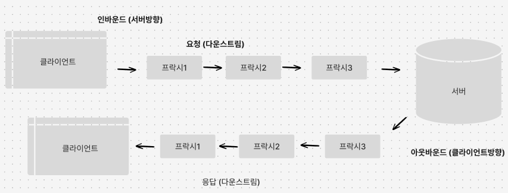

# 3.HTTP 메세지

## 3.1 메시지의 흐름

- HTTP 메세지란 HTTP 애플리케이션 간에 주고받은 데이터들의 블록들이다.

### 3.1.1 메시지는 원 서버 방향을 인바운드로 하여 송신된다.

- 인바운드: 클라이언트 —> 서버
  - 메시지가 원 서버로 향하는 트랜젝션 방향을 뜻함
- 아웃바운드: 서버 —> 클라이언트
  - 메시지가 사용자 에이전트로 돌아오는 트랜젝션 방향을 뜻함

### 3.1.2 다운스트림으로 흐르는 메시지

- 요청/응답 메시지냐에 관계 없이 모든 메시지는 다운스트림으로 흐름.

  

## 3.2 메시지의 각 부분

| 시작줄 | 어떤 메세지인지 서술 | HTTP/1.0 200 OK                               |
| ------ | -------------------- | --------------------------------------------- |
| 헤더   | 속성                 | Content-type: text/plain; Content-length: 19; |
| 본문   | 데이터               | Hi! I’m a message!                            |

### 3.2.1 메시지 문법

- 메서드: GET, POST, DELETE…등
- 요청 URL: 요청 대상이 되는 리소스를 지칭하는 완전한 URL
- 버전: 사용중인 HTTP 버전 `HTTP/<메이저>.<마이너>`
- 상태코드: 상공, 에러 … (200, 401..)
- 사유구절: 상태코드에 대한 의미 설명
- 헤더들: 이름, 콜론, 선택적인 공백, 값, CRLF가 순서대로 나타나는 0개 이상의 헤더들
- 엔티티 본문: 데이터 블록

### 3.2.2 시작줄

모든 HTTP 메시지는 시작줄로 시작함.

- 요청줄: 메서드, 요청 URL, HTTP버전을 포함하며 공백으로 필드가 구분된다.
  - `GET /test/hi-there.text HTTP1.1`
- 응답줄: HTTP버전, 상태코드, 수행상태 설명
  - `HTTP1.1 200 OK`
- 메서드: 우리가 흔히 아는 HTTP메서드의 종류들이며 다른 서버는 메서드를 추가로 구현했을 수도 있음. 이를 확장 메서드라함
  - GET, POST, DELETE….
- 상태코드
- | 전체범위 | 정의된 점위 | 분류            |
  | -------- | ----------- | --------------- |
  | 100-199  | 100-101     | 정보            |
  | 200-299  | 200-206     | 성공            |
  | 300-399  | 300-305     | 리다이렉션      |
  | 400-499  | 400-415     | 클라이언트 에러 |
  | 500-599  | 500-505     | 서버 에러       |
- 사유구절: 응답 시작줄의 마지막 구성요소 이며 요청에 따른 정보를 알려준다.
- 버전번호: 요청/응답 메세지 양쪽 모두에 기술된다. (1.1과 2.0 통신 시 2.0은 해당 버전의 기능을 사용할 수 없음)

### 3.2.3 헤더

일반헤더, 요청헤더, 응답헤더, Entity헤더, 확장헤더가 있으며 애플리케이션은 자유롭게 자신만의 헤더를 만들 수 있음

### 3.2.4 엔터티 본문

선택적이며 이미지, 비디오, HTML문서, 소프트웨어 어플리케이션, 신용카드 트랜젝션, 전자유편 등 여러 종류의 디지털 데이터를 실어 나를 수 있음

## 3.3 메서드

### 3.3.1 안전한 메서드

GET, HEAD는 안전하다고 할 수 있는데 이는 HTTP요청의 결과로 서버에 어떤 작용도 일어나지 않는다. 이를 보면 안전하다 라는 의미로 해석할 수있음.

### 3.3.2 GET

가장 흔히 쓰는 메서드. 리소스를 서버에 요청할 때 사용

### 3.3.3 HEAD

GET과 동일하게 사용하지만, 서버는 응답으로 헤더만 돌려줌.

- 리소스를 가져오지 않고 타입 등과같은 것을 알아낼 수 있음
- 응답의 상태코드로 개체 존재 여부 확인 가능
- 헤더를 확인하여 리소스 변경 여부 확인 가능

### 3.3.4 PUT

새 콘텐츠 생성. 이미 존재한다면 수정할때 사용됨.

### 3.3.5 POST

입력 데이터 전송을 위해 설계됨. HTML 폼 지원.

### 3.3.6 TRACE

클라이언트에게 자신의 요청이 서버에 도달했을 때 어떻게 보이게 되는지 보여줌.

주로 진단을 위해 사용되며, 요청이 의도한 요청/응답 연쇠를 거쳐가는지 검사할 수 있다.

- `TRACE /produce-list.txt HTTP/1.1`

### 3.3.7 OPTIONS

웹 서버에게 여러가지 종류의 지원 범위에 대해 물어봄.

서버에게 특정 리소스에 대해 어떤 메서드가 지원되는지 물어볼 수 있음

- `OPTIONS * HTTP/1.1`

### 3.3.8 DELETE

리소스 삭제 요청

### 3.3.9 확장 메서드

HTTP는 필요에 따라 확장할 수 있도록 설계되었으므로, 새로 기능을 추가해도 과거에 구현된 소프트웨어들의 오작동을 유발하지 않는다.

## 3.4 상태코드

클라이언트에게 그들의 트랜잭션을 이해할 수 있는 방법 제공

### 3.4.1 100-199: 정보성 상태코드

HTTP/1.1에 도입되었음, .. 서버, 클라이언트, 프락시와 100 Continue에 대한 설명이 있으나 현업에선 거의 사용되지 않으므로,, 패스

### 3.4.2 200-299: 성공 상태 메서드

요청 성공

### 3.4.3: 리다이렉션 상태코드

### 3.4.4: 400-499: 클라이언트 에러 상태 코드

### 3.4.5: 500-599: 서버 에러 상태 코드

## 3.5 헤더

### 3.5.1 일반 헤더

클라이언트, 서버 양쪽 모두 사용하며 다양한 목적으로 사용된다.

- `Date: Tue, 3 Oct 1974 02:16:00 GMT` : 서버, 클라이언트를 가리지않고 메시지가 만들어진 일시 지칭 목적으로 사용

### 3.5.2 요청헤더

요청을 위한 헤더이며, 서버에게 클라이언트가 받고자 하는 데이터 타입이 무엇인지와 같은 부가정보를 제공한다.

- `Accept: */*` : 서버에게 클라이언트가 자신의 요청에 대응하는 어떤 미디어 타입도 받아들일 것임을 의미

### 3.5.3 응답 헤더

클라이언트에게 정보를 제공하기 위한 자신만의 헤더를 갖고있다.

- `Sever: Tiki-Hut/1.0` : 서버헤더는 클라이언트에게 그가 Tik-Hut서버 1.0버전과 대화하고있음을 알려줌

### 3.5.4 엔터티 헤더

엔터티 본문에 대한 헤더이다.

- `Content-Type: text/html; charset=ios-latin-1`
