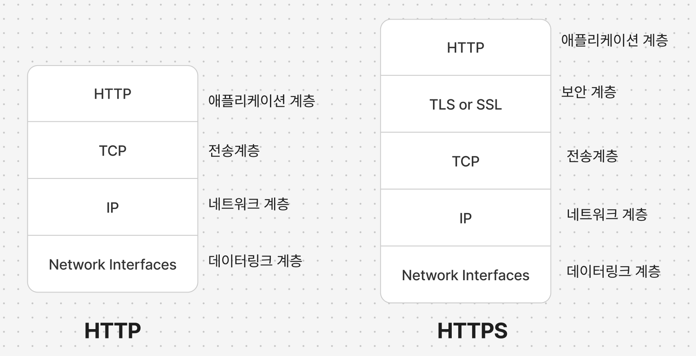

# 4. 커넥션 관리

## 4.1 TCP 커넥션

클라이언트 애플리케이션은 서버애플리케이션으로부터 TCP/IP 커넥션을 맺을 수 있으며, 주고받는 메세지들은 손상, 손실이 되거나 순서가 바뀌지 않고 안전하게 전달된다.

### 웹 브라우저가 TCP 커넥션을 통해 요청하는 순서

1. `http://www.joes-hardware.com:80/power-tools.html` URL로 요청
2. 브라우저가 연결 정보 추출
   1. `http://www.joes-hardware.com` 호스트 명 추출
   2. 호스트명에 대한 ip 주소 찾음 → `202.43.78.3`
   3. 포트 찾음 → `80`
3. 브라우저가 `202.43.78.3:80` 로 TCP 커넥션 생성
4. 브라우저가 서버에서 온 HTTP 응답 메세지 읽음
5. 브라우저가 커넥션 끊음

### 4.1.1 신뢰할 수 있는 데이터 전송 통로인 TCP

TCP는 HTTP에게 신뢰할만한 통신 방식 제공. TCP커넥션은 인터넷을 안정적으로 연결함.

### 4.1.2 TCP 스트림은 세그먼트로 나뉘어 IP 패킷을 통해 전송된다.

- TCP는 **세그먼트**라는 단위로 데이터 스트림을 잘게 나누고, 세그먼트를 IP 패킷이라고 불리는 봉투에 담아서 인터넷을 통해 데이터를 전달한다.
- 각 TCP 세그먼트는 하나의 IP 주소에서 다른 IP 주소로 IP패킷에 담겨 전달된다.

### 4.1.3 TCP 커넥션 유지하기

- 커넥션은 네가지 값으로 식별한다. 이 네가지 값으로 유일한 커넥션을 생성한다.
  - <`발신지 주소`, `발신지 포트`, `수신지 IP주소`, `수신지 포트`>

### 4.1.3 TCP 소켓 프로그래밍

- 클라이언트와 서버가 TCP 소켓 인터페이스를 사용하여 상호작용 하는 방법은 아래와 같다.
  

## 4.2 TCP의 성능에 대한 고려

HTTP는 TCP 바로 위에 있는 계층이기 때문에 HTTP 트랜잭션의 성능은 TCP 성능에 영향을 받는다.
(책 내용중 관심 없으면 넘어가라 했지만 일단 읽음..)

### 4.2.1 HTTP 트랜잭션 지연

- **HTTP 트랜잭션을 지연 시키는 원인**
  - 클라이언트가 해당 URI에 대한 접속 기록이 없으면 DNS 이름분석 인프라를 사용하여 호스트명을 IP 주소로 변환하는데 시간이 걸리게 됨.
  - 클라이언트가 TCP 요청을 하게 되면 항상 새로운 커넥션이 설정되는데 이 때 소요시간이 발생됨. 이 때문에 수백개의 HTTP 트랜잭션이 생성되면 소요시간이 증가됨.
  - 커넥션 → HTTP요청 전송 → 서버에서 요청 메세지 처리 → 전달 이 과정에서 소요시간이 발생됨.
  - 웹서버가 HTTP 응답을 보내는것 역시 시간이 소요됨

### 4.2.2 성능 관련 중요 요소

아래 목차 내용

### 4.2.3 TCP 커넥션 핸드셰이크 지연

작은 크기의 데이터를 전송하는데 커넥션이 사용되면 성능 저하에 요인이됨. 크기가 작은 HTTP 트랜잭션은 50% 이상의 시간을 TCP를 구성하는데 쓰기 때문이다.

### 4.2.4 확인 응답 지연

확인 응답 알고리즘으로 인한 지연이 자주 발생됨.

### 4.2.5 TCP 느린 시작(slow start)

처음엔 커넥션의 최대 속도 시간을 제한하고 성공적으로 전송될때 마다 자체적으로 “튜닝”됨. 새로운 커넥션은 “튜닝”된 커넥션 보다 느리다.

### 4.2.6 네이글 알고리즘과 TCP_NODELAY

### 4.2.7 TIME_WAIT의 누적과 포트 고갈

## 4.3 HTTP 커넥션 관리

### 4.3.1 흔히 잘못 이해하는 Connection 헤더

HTTP는 클라이언트와 서버 사이에 프락시서버, 캐시서버 등과 같은 중개 서버가 놓이는 것을 허락한다.
어떤 경우에는 현재 맺고있는 커넥션에만 적용될 옵션을 별도로 지정해야 할 때가 있다.

- **Connection 헤더의 세가지 종류 토큰**
  1. HTTP 헤더 필드명은, 이 커넥션에만 해당되는 헤더만 나열함.
  2. 임시적 토큰값은 커넥션에 대한 비표준 옵션 의미
  3. close 값은, 커넥션이 완료되면 종료되어야함을 의미

커넥션 토큰이 HTTP 헤더 필드명을 가지고 있으면 해당 필드들은 다음 커넥션에 전달되면 안됨.

### 4.3.2 순차적인 트랜잭션 처리에 의한 지연

순차 처리로 인한 지연에는 물리적인 지연 뿐 아니라 하나의 이미지를 내리고 있는중 웹 페이지에 아무것도 보여지지 않아 느껴지지는 심미적 지연도 있음.

- **HTTP 커넥션 성능 향상을 위한 기술**
  1. 병렬(parallel) 커넥션: 여러개의 TCP 커넥션응ㄹ 통한 동시 HTTP 요청
  2. 지속(persistent)커넥션: 커넥션을 맺고 끊는 데서 발생하는 지연을 제거하기 위한 TCP 커넥션의 재활용
  3. 파이프라인(pipelined)커넥션: 공유 TCP 커넥션을 통한 병렬 HTTP요청
  4. 다중(multiplexed)커넥션: 요청과 응답들에 대한 중재(실험적 기능)

## 4.4 병렬 커넥션

### 4.4.1 병렬 커넥션은 페이지를 더 빠르게 내려받는다.

하나의 커넥션에서 모든 데이터를 전달 받는것 보다 병렬 커넥션 방식으로 병렬로 요청하면 총 지연시간이 줄어듦.

### 4.4.2 병렬 커넥션이 항상 더 빠르진 않다.

제한된 대역폭에서 객체를 병렬로 내려받는 경우 각 객체를 전송받는게 느리기 때문에 항상 빠르진 않음. 다수의 커넥션은 메모리를 많이 소모하고 성능 문제를 발생시키기 때문.

브라우저는 병렬 커넥션을 사용하긴 하지만 대부분 4개정도의 적은수의 커넥션만 허용한다. 과도한 커넥션이 이루어질 경우 서버는 임의로 끊을 수도있음.

### 4.4.3 병렬 커넥션은 더 빠르게 ‘느껴질 수’ 있다

사용자는 단일 커넥션으로 요청할 경우 텅 빈 화면을 볼 수도 있지만, 병렬 커넥션으로 요청할 경우 여러개의 데이터를 가져오는 상황을 볼 수 있기 때문에 더 빠르게 느껴질 수 있다.

## 4.5 지속 커넥션

HTTP1.1을 지원하는 기기는 처리가 완료된 후에도 TCP 커넥션을 유지하여 앞으로 있을 요청에 재사용할 수 있다. 이를 지속 커넥션이라 함. 이는 TCP의 느린 시작으로 인한 지연을 피할 수 있다.

### 4.5.1 지속 커넥션 vs 병렬 커넥션

- **병렬 커넥션의 단점**
  1. 각 트랜잭션마다 새로운 커넥션을 맺기 때문에 시간과 대역폭이 소요됨
  2. 각각의 새로운 커넥션은 TCP 느린 시작때문에 성능이 떨어짐
  3. 실제로 연결할 수 있는 병렬 커넥션 수에는 제한이 있음
- **지속 커넥션의 장점**
  - 커넥션을 맺기 위한 사전작업과 지연을 줄이고, 튜닝된 커넥션 유지한다.

지속 커넥션의 장점도 있지만 이를 잘못 관리할 경우 계속 연결 상태인 커넥션이 수많이 쌓이게 될 수 있으므로 불필요한 리소스의 소모가 많아질 수 있어 병렬 커넥션과 함께 사용될때가 가장 효과적이다.

### 4.5.2 HTTP/1.0+의 Keep-Alive 커넥션

HTTP/1.0에서 사용되었으나 설계상 문제가 있었고 1.1버전에서 개선됨. 여러개의 커넥션을 맺고 끊고 하는것보다 keep-alive를 사용하여 지속 커넥션을 사용할 경우 처리 시간이 줄어든다.

### 4.5.3 Keep-Alive 동작

클라이언트는 응답에 Connection: Keep-Alive 헤더가 없으면 응답 받은 후 커넥션을 끊을것이라 추정한다

### 4.5.4 Keep-Alive 옵션

Keep-Alive헤더는 커넥션을 유지하기를 바라는 요청일 뿐이며 클라이언트나 서버가 이를 요청받았다고 해서 무조건 따를 필요는 없다.

- Connection: Keep-Alive
  Keep-Alive: max=5, timeout=120 - 서버가 약 5개의 추가 트랜잭션이 처리될 동안 커넥션 유지하거나 2분동안 커넥션을 유지하라는 내용 - 이대로 동작한다는 보장은 없음

### 4.5.5 Keep-Alive 커넥션 제한과 규칙

- keep-alive는 HTTP/1.0에서 기본으로 사용되지 않는다. 별도의 `Connection: Keep-Alive` 요청헤더를 보내야한다.
- 커넥션을 유지하려면 모든 메세지에 `Connection: Keep-Alive` 요청헤더를 보내야한다. 보내지 않으면 요서버는 요청 처리 후 커넥션을 끊는다.
- 커넥션이 끊어지기 전에 엔터티 본문의 길이를 알아야 커넥션을 유지한다.
  - 엔터티 본문의 정확한 Content-Length값, 멀티파트 미디어 형식(multipart-media type), 청크전송 인코딩(chuncked transfer encoding)으로 인코딩 되어야한다.
  - 잘못된 Content-Length값을 보내면 트랜잭션이 끝나는 시점에 기존 메시지의 끝과 새로운 메시지의 시작점을 정확히 알 수 없다.
- 프락시와 게이트웨이는 Connection 헤더의 규칙을 철저히 지켜야한다.
  - 프락시와 게이트웨이는 메시지를 전달하거나 캐시를 넣기 전에 Connection 헤더에 명시된 헤더 필드와 Connection 헤더를 제거해야함
- 멍청한 프락시로 인해 문제가 발생할 수 있으므로 Connection헤더를 인식하지 못하는 서버와는 커넥션이 맺어지면 안되지만 현실적으로 쉽지않음.
- 기술적으로 HTTP/1.0을 따르는 기기로부터 받은 모든 Connection 헤더 필드는 무시해야한다.
- 클라이언트는 커넥션이 전체 응답을 받기 전에 끊어지면 바로 요청할 수 있도록 준비되어있어야한다.

### 4.5.6 Keep-Alive와 멍청한 프락시

- **Connection 헤더의 무조건 전달**
  - 멍청한 프락시는 헤더를 이해하지 못해서 해당 헤더들을 삭제하지 않고 요청 그대로 다음 프락시에 전달하는데, 이런 잘못된 통신 때문에 브라우저와 서버가 타임아웃이 나는등 커넥션이 끊길때까지 기다리는등의 오류들이 발생된다.
- **프락시와 홉별 헤더**
  - 잘못된 통신을 피하려면 프락시는 Connection헤더와 Connection 헤더에 명시된 헤더들은 절대 전달하면안됨
  - Proxy-Authenticate, Proxy-Connetion, Transfer-Encoding, Upgrade와 같은 홉별 헤더들 역시 전달하면 안됨.

### 4.5.7 Proxy-Conection 살펴보기

- 멍청한 프락시 때문에 발생되는 문제들을 해결하기 위해 넷스케이프의 브라우저, 프락시 개발자들은 비표준 헤더 Proxy-Connection헤더를 사용하도록 차선책을 제시함. 이를 사용하면 일반적으로 전달하는 Connection헤더 대신 이를 전달함으로 써 웹 서버가 무시하도록 한다.
- 똑똑한 프락시는 Proxy-Connection헤더를 인식하고 이를 잘 전달한다.

### 4.5.8 HTTP/1.1의 지속 커넥션

HTTP/1.1은 지속 커넥션이 기본적으로 활성화 되어있으며, 트랜잭션이 끝난 후 연결을 끊으려면 `Connection:close` 헤더를 명시 해야한다. 이 헤더가 없으면 유지하는것으로 추정한다. 하지만 언제든 연결을 끊을수 있고, 이것이 영원이 유지하겠다는 것을 뜻하진 않는다.

### 4.5.9 지속 커넥션의 제한과 규칙

- 클라이언트가 요청에 `Connection:close` 헤더를 포함해 보내면, 그 커넥션으로 클라이언트는 추가 요청을 할 수 없다
- 클라이언트가 해당 커넥션으로 추가 요청을 하지 않을것이라면, 마지막 요청에 `Connection:close` 헤더를 보내야한다.
- 커넥션에 있는 모든 메시지가 자신의 길이정보를 정확히 가지고 있을 때에만 커넥션을 지속시킬 수 있다. (4.5.5 내용에 있는 설명 확인)
- HTTP/1.1 프락시는 클라이언트와 서버 각각에 대해 별도의 지속 커넥션을 맺고 관리해야함.
- HTTP/1.1 프락시 서버는 클라이언트가 커넥션 관련 기능에 대한 클라이언트의 지원범위를 알고있지 않은 한 지속 커넥션을 맺으면 안됨.(오래된 프락시가 Connection 헤더를 전달하는 문제가 발생할 수 있음) 잘 지켜지진 않음.
- 서버는 요청에 대한 메세지를 전송하는 동안은 커넥션을 끊지 않고, Connection헤더의 값과는 상관없이 언제든 끊을 수 있음
- HTTP/1.1은 중간에 끊어지는 커넥션을 복구할 수 있어야함. 클라이언트는 다시 보내도 문제가 없는 요청이라면 다시 보내야함.
- 하나의 사용자 클라이언트는 서버의 과부하를 방지하기 위해, 넉넉잡아 두개의 지속 커넥션만 유지해야한다.

## 4.6 파이프라인 커넥션

[HTTP/1.x의 커넥션 관리 - HTTP | MDN](https://developer.mozilla.org/ko/docs/Web/HTTP/Connection_management_in_HTTP_1.x#http_%ED%8C%8C%EC%9D%B4%ED%94%84%EB%9D%BC%EC%9D%B4%EB%8B%9D)

→ HTTP 파이프라인 커넥션이미지 찾다가 잠깐 읽어봤는데 모던 브라우저에서 기본적으로 안쓰이고, [`GET`](https://developer.mozilla.org/ko/docs/Web/HTTP/Methods/GET), [`HEAD`](https://developer.mozilla.org/ko/docs/Web/HTTP/Methods/HEAD), [`PUT`](https://developer.mozilla.org/ko/docs/Web/HTTP/Methods/PUT) 그리고 [`DELETE`](https://developer.mozilla.org/ko/docs/Web/HTTP/Methods/DELETE) 메서드같은 [idempotent](https://developer.mozilla.org/ko/docs/Glossary/Idempotent) 메서드만 가능하다고 한다.

- **파이프라인 커넥션의 제약사항**
  1. HTTP 클라이언트는 커넥션이 지속 커넥션인지 확인하기 전까지는 파이프라인을 이어선 안됨.
  2. HTTP응답은 요청 순서와 같네 아와야한다. HTTP 메시지는 순번이 매겨져 있지 ㅇ낳아서 응답이 순서 없이 오면 순서에 맞게 정렬시킬 방법이 없음.
  3. HTTP 클라이언트는 커넥션이 언제 끊어지더라도, 완료되지 않은 요청이 파이프라인에 있으면 언제든지 다시 요청을 보낼 준비가 되어있어야한다. 예상치 못하게 끊긴 커넥션을 다시 맺고 요청을 보낼 수 있어야함.
  4. HTTP클라이언트는 POST 요청같이 반복해서 보낼 경우 문제가 생기는 요청은 파이프라인을 통해 보내면 안됨.

## 4.7 커넥션 끊기에 대한 미스터리

커넥션 관리엔 명확한 기준도 없고 그에 관한 기술 문서도 별로 없음

### 4.7.1 ‘마음대로’ 커넥션 끊기

어떠한 HTTP클라이언트, 서버, 프락시들은 언제든 TCP전송 커넥션을 끊을 수 있다.

→ 지속 커넥션이 일정 시간동안 요청을 전송하지 않은 줄 알고 서버가 커넥션을 끊을때 클라이언트가 요청을 하게되면 문제가 발생될 수 있음.

### 4.7.2 Content-Length와 Truncation

각 HTTP응답은 본문의 정확한 크기를 가지는 Content-Length헤더를 갖고있어야함. 잘못된 Content-Length를 보내서도안됨.

### 4.7.3 커넥션 끊기의 허용, 재시도, 멱등성

클라이언트는 POST와 같이 멱등이 아닌 요청은 파이프라인을 통해 요청하면 안됨.

GET, HEAD, PUT, DELETE, TRACE, OPTIONS 메서드들은 멱등하다고 하는데 이 뜻은 여러번 반복해도 같은 결과 값을 반환한다는 것을 의미한다.

비멱등인 메서드는 자동으로 재실행시키면 안됨. 캐시된 POST요청을 보내려고 할땐 다시 보내길 원하는지 대화상자를 표기해준다.

### 4.7.4 우아한 커넥션 끊기

- **전체 끊기와 절반 끊기**
  - `close()`를 호출하면 TCP 커넥션의 입력/출력 채널 커넥션을 모두 끊음
  - `shutdown()`을 호출하면 입력채널이나 출력 채널을 개별적으로 끊을 수 있음
- **TCP 끊기와 리셋 에러**
  - 보통 커넥션의 출력 채널을 끊는것이 안전함
  - 연결이 끊긴 커넥션에 데이터가 도착하면 `‘connection reset by peer’` 에러발생
    → 이 메세지는 입력 버버테 있는 데이터를 지움 (응답데이터가 삭제되는 이슈)
- **우아하게 커넥션 끊기**
  - 애플리케이션 자신의 출력 채널을 먼저 끊고 다른 쪽에 있는 기기의 출력 채널이 끊기는것을 기다린다. 양쪽에서 더는 데이터를 전송하지 않을 것이라고 알려주면(예를들어 출력 채널의 커넥션을 끊는 것). 커넥션은 리셋의 위험 없이 온전히 종료된다.
